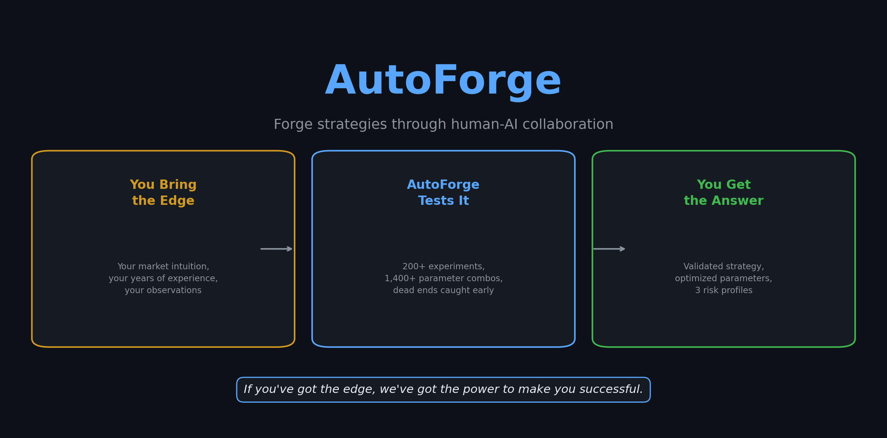
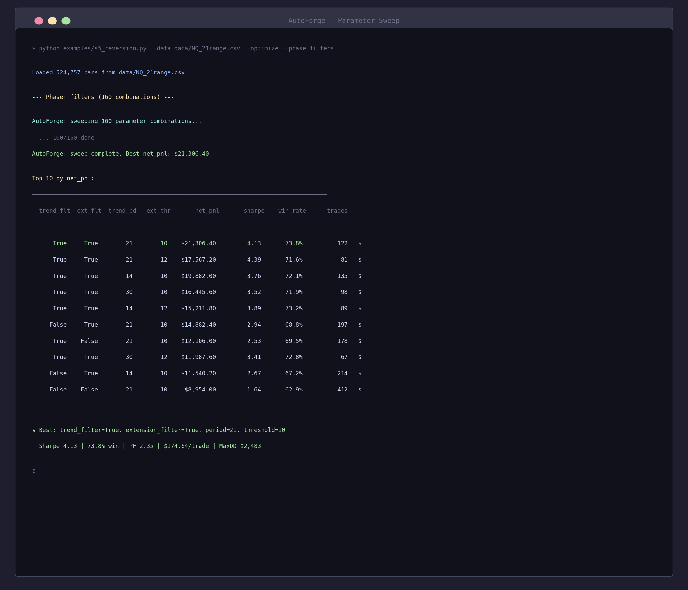
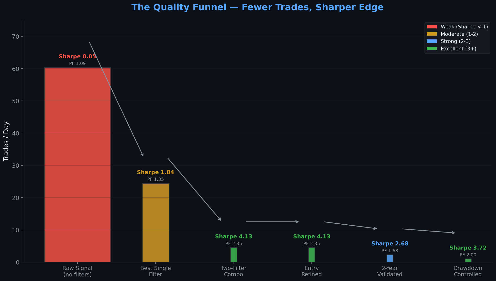
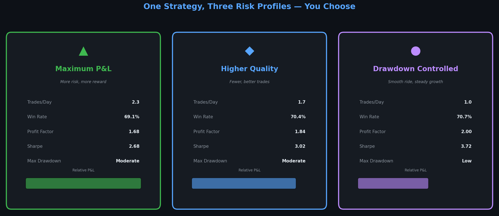
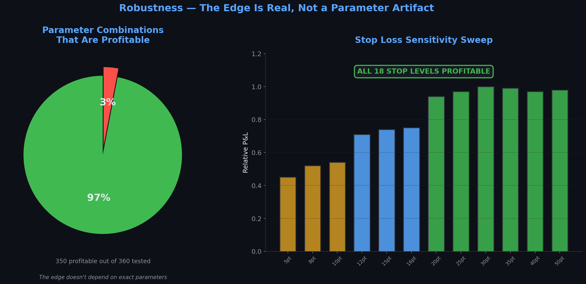
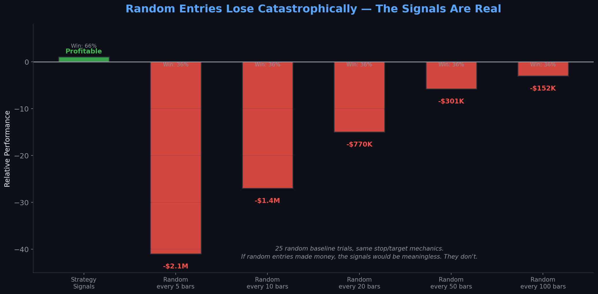

# AutoForge



*A trader with 10 years of screen time sees things — patterns that repeat, setups that "feel right" before the move happens. But turning that intuition into rules, testing every parameter combination, and proving the edge is real? That used to take months. Now you describe your edge to an AI, it interviews you until the spec is tight, codes the strategy, sweeps thousands of parameter combos, and tells you if it's real or if you're fooling yourself. You wake up to a validated strategy with optimized parameters — or an honest "there's no edge here." Either way, you saved months. This is how it began. -@saikodi, March 2026*

The idea: you bring a market intuition — something you've observed but never formalized. AutoForge pairs you with an AI research partner that interviews you, turns your observation into code, then exhaustively tests it. Not a 5-minute training run like [AutoResearch](https://github.com/karpathy/autoresearch) — hundreds or thousands of parameter combinations, swept in parallel, with rigorous validation (ablation tests, random baselines, stop sensitivity). The core idea is that you're not writing the strategy code yourself. Instead, you're programming the `program.md` Markdown file that instructs the AI agent — what to ask, how to optimize, when to kill a dead end. The AI does the grunt work. You make the decisions.

## How it works

The repo has six files that matter:

- **`autoforge/strategy.py`** — Strategy base class. Your strategies extend this with `params`, `indicators()`, and `on_bar(ctx)`.
- **`autoforge/backtest.py`** — Runs a strategy against data. Market orders fill at next bar's Open, limit orders fill at price if touched. Realistic.
- **`autoforge/prepare.py`** — Loads CSV data, computes indicators (SMA, EMA, RSI, Bollinger, ATR, VWAP, Slope). Add your own here.
- **`autoforge/evaluate.py`** — Metrics: Sharpe, win rate, profit factor, drawdown, daily P&L. Formatted report.
- **`autoforge/optimize.py`** — Parameter sweep. Local multiprocessing or [hive-mcp](https://github.com/saikodi/hive-compute-mcp) for distributed sweeps across your LAN.
- **`program.md`** — Instructions for the AI agent. The collaboration methodology — how to interview, discover, optimize, validate. **This file is edited and iterated on by the human.**

Strategies declare their tunable parameters upfront. The optimizer overrides them, runs the backtest, collects metrics, and ranks every combination. You don't guess — you search.

## Quick start

**Requirements:** Python 3.10+, numpy, pandas. Any OS.

```bash
# 1. Clone and install
git clone https://github.com/saikodi/AutoForge.git
cd AutoForge
pip install -e .

# 2. Bring your data (OHLCV CSV: DateTime, Open, High, Low, Close, Volume)
#    Place CSV files in data/

# 3. Run an example backtest
python examples/sma_crossover.py --data data/your_data.csv

# 4. Run a parameter sweep (800 combinations)
python examples/sma_crossover.py --data data/your_data.csv --optimize --workers 6
```

If the above commands work, your setup is ready. Point your AI agent at `program.md` and start describing your strategy.

## Running the agent

Spin up Claude Code (or whatever you prefer) in this repo, then prompt something like:

```
Hi, have a look at program.md. I have a strategy idea I'd like to explore.
```

The AI will interview you, code the strategy, backtest it, and optimize the parameters. `program.md` is the "skill" that drives the collaboration.

## What it looks like

A parameter sweep across 160 filter combinations:



## Real results

AutoForge was used to develop real futures strategies. Two case studies document the process — every phase, every decision, every dead end — without revealing the proprietary strategy details.

### Case Study #1: Forging a strategy from scratch
*200+ experiments across 8 phases. From a vague intuition to a validated strategy with three risk profiles.*



60 trades/day with a paper-thin edge became 4.5 trades/day with a Sharpe above 4. Trailing stops were tested and killed. A filter that produced zero trades was caught in hours. Signal methods with no edge were dropped. The final output: three risk configurations — the trader picks the tradeoff.



**[Read Case Study #1 →](docs/case-study.md)**

### Case Study #2: Proving an edge is real
*3,500+ parameter combinations. Ablation tests, random baselines, stop sensitivity sweeps.*



97% of parameter combinations were profitable. Every stop level tested was profitable. Random entries with the same mechanics lost catastrophically (-$152K to -$2.1M). The signals are real. Combined with an uncorrelated momentum strategy, drawdown dropped 32%.



**[Read Case Study #2 →](docs/case-study-mr.md)**

## Design choices

- **Human-AI collaboration, not autonomous.** Unlike fully autonomous systems, AutoForge keeps you in the loop. The AI interviews you, suggests things you haven't considered, and does the grunt work — but you make every decision. Your domain expertise drives the process.
- **Rule-based, not ML.** AutoForge is for deterministic strategies with discrete parameters, not neural nets or gradient descent. The optimization is combinatorial search, not backpropagation.
- **Exhaustive search, not guessing.** When you have 6 parameters with 5 values each, that's 15,625 combinations. AutoForge tests all of them. If there's a sweet spot, it finds it. If there isn't one, it tells you.
- **Prove it or kill it.** Validation isn't optional. Random baselines, ablation tests, out-of-sample testing, stop sensitivity sweeps. If the edge isn't real, AutoForge will show you. Better to find out in backtest than with real money.
- **Minimal by design.** Six files, not a framework. No complex configs, no plugin systems, no 50-module architecture. If you can read Python, you can read the entire codebase in 30 minutes.

## Project structure

```
autoforge/
  strategy.py     — base class for strategies (agent writes these)
  backtest.py     — runs strategy against data, produces trades
  prepare.py      — data loading + indicator computation
  evaluate.py     — metrics and reporting
  optimize.py     — parameter sweep (local or distributed)
program.md        — agent instructions (human iterates on this)
examples/         — toy strategies (SMA crossover, RSI, S5 reversion)
docs/             — case studies with full walkthroughs
```

## Beyond trading

While trading is the proof case, the pattern — **AI interviews domain expert, codes rule-based logic, exhaustively optimizes parameters, validates rigorously** — applies anywhere you have tunable rule-based systems: alert thresholds, scoring systems, manufacturing rules, decision trees. The forge doesn't care what you're forging.

## Scaling with hive-mcp

For large sweeps (thousands of combinations), AutoForge integrates with [hive-mcp](https://github.com/saikodi/hive-compute-mcp) to distribute work across idle machines on your LAN. Same interface, more compute.

## Disclaimer

AutoForge is a research and educational tool. It does not provide financial advice. Trading futures and other financial instruments involves substantial risk of loss and is not suitable for all investors. Past performance — including any results shown in this repository — is not indicative of future results. Always do your own research and consult with a qualified financial advisor before trading with real money. Use at your own risk.

## Contributing

Contributions welcome! See [CONTRIBUTING.md](CONTRIBUTING.md).

## License

MIT
