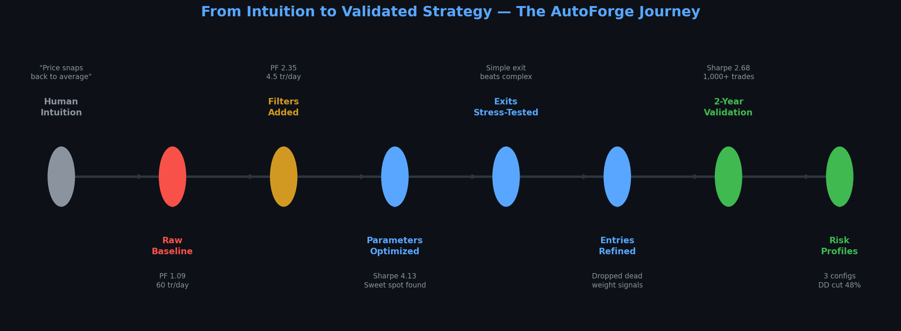
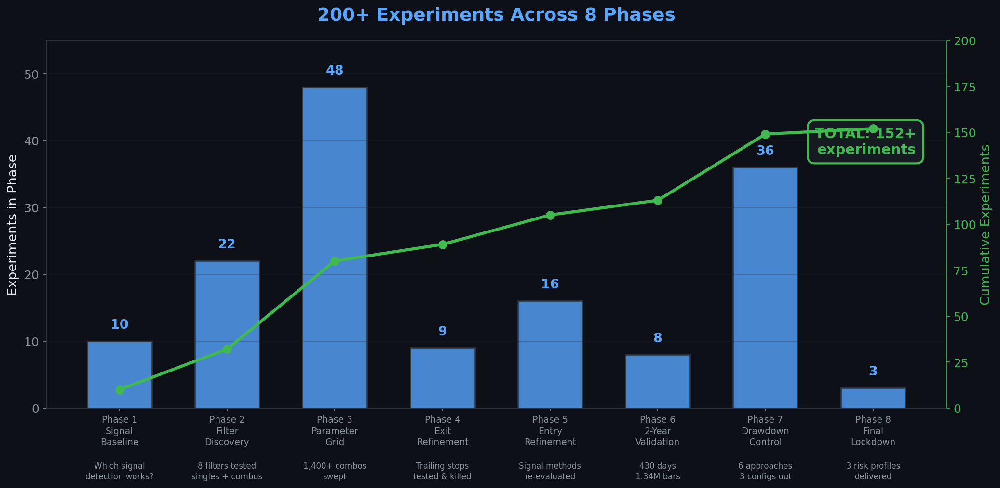
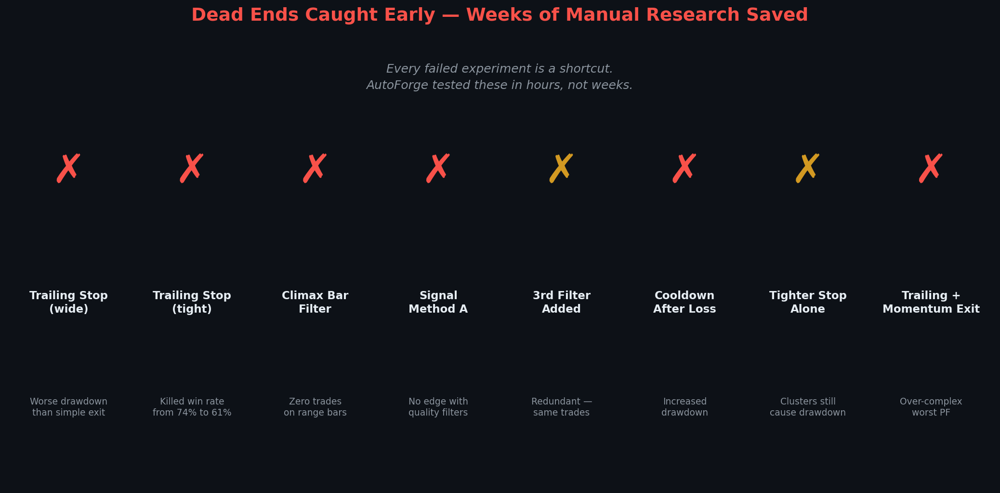
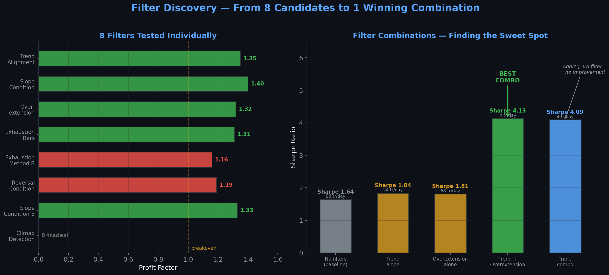
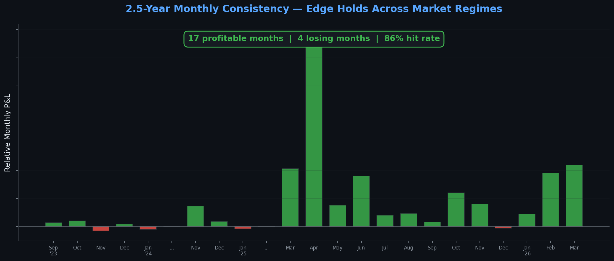

# AutoForge

**Forge strategies through human-AI collaboration.**

<p align="center">
  
</p>

AutoForge is an open-source workbench where you describe your edge in plain English, and an AI partner helps you code it, stress-test it, optimize it, and tell you if it's real.

Inspired by [Karpathy's AutoResearch](https://github.com/karpathy/autoresearch), but for a fundamentally different domain. AutoResearch runs quick ML experiments (5-minute wallclock, gradient descent, loss curves). AutoForge is about **rule-based systems** — deterministic strategies with discrete parameters, optimized through exhaustive search across hundreds or thousands of combinations.

> *If you've got the edge, we've got the power to make you successful.*

## Philosophy

- **You bring the edge.** AutoForge doesn't give you a strategy. You bring your market intuition, your years of screen time, your observations about how price moves. AutoForge helps you formalize it, test it rigorously, and optimize it.

- **AI as research partner, not black box.** The AI interviews you, asks clarifying questions, suggests conditions you haven't considered, and surfaces blind spots. Then it does the grunt work — coding, backtesting, sweeping thousands of parameter combinations.

- **Prove it or kill it.** Every idea gets stress-tested across historical data. If the edge isn't there, AutoForge will show you. Better to find out in backtest than with real money.

- **The method, not the alpha.** AutoForge ships the forge — you bring your own metal. No proprietary strategies included. Only toy examples (SMA crossover, basic RSI) to demonstrate the workflow.

## See It in Action

AutoForge was used to develop a real futures strategy through **200+ experiments across 8 phases**. Here's what that looks like:

### From intuition to validated strategy

<p align="center">
  
</p>

### The quality funnel — fewer trades, sharper edge

Every phase improved signal quality. We went from 60 trades/day with a paper-thin edge to 4.5 trades/day with a Sharpe above 4:

<p align="center">
  
</p>

### 200+ experiments, 1,400+ parameter combinations

AutoForge doesn't guess — it exhaustively searches:

<p align="center">
  
</p>

### Dead ends caught in hours, not weeks

Every failed experiment is a shortcut. These would have consumed weeks of manual research:

<p align="center">
  
</p>

### AI discovers the winning filter combination

8 filters tested individually, then systematically combined. The best pair emerged from data, not guesswork:

<p align="center">
  
</p>

### One strategy, three risk profiles — you choose

The final output isn't a single answer. It's a dial between risk and reward:

<p align="center">
  
</p>

### Validated across 2.5 years of market data

<p align="center">
  
</p>

**Read the full case study: [docs/case-study.md](docs/case-study.md)**

---

## The Pipeline

```
 You ──► Describe your edge in plain English
  │
  ▼
 AI ──► Interviews you, surfaces blind spots, suggests parameters
  │
  ▼
 AI ──► Codes the strategy using AutoForge's framework
  │
  ▼
 AI ──► Optimizes — sweeps hundreds/thousands of parameter combos
  │
  ▼
 AI ──► Backtests, reports metrics (Sharpe, win rate, drawdown, P&L)
  │
  ▼
 AI ──► Exports code for your trading platform
  │
  ▼
You ──► Platform backtest → Market replay → Sim trade → Go live
```

AutoForge handles the research loop. The final validation — platform backtesting, market replay, sim trading, and going live — is yours.

## How It's Different

| | AutoResearch | AutoForge |
|--|-------------|-----------|
| Domain | ML / neural nets | Rule-based systems |
| Optimization | Gradient descent | Combinatorial parameter sweep |
| Experiment time | 5-minute wallclock | Hundreds of runs, find the best |
| AI role | Autonomous overnight | Collaborative — interviews, discovers, optimizes |
| Edge source | Architecture search | Human domain expertise + AI-assisted discovery |
| Key output | Lower val_bpb | Validated strategy with optimized parameters |

## Quick Start

### 1. Install

```bash
pip install -e .
```

### 2. Bring your data

Place your OHLCV CSV files in `data/`. Expected columns: `DateTime, Open, High, Low, Close, Volume`.

```
data/
  NQ_21range.csv
  ES_5min.csv
```

### 3. Talk to the AI

Open `program.md` — it contains the instructions that guide the AI through the collaboration loop. Point your AI agent (Claude, etc.) at this project and start describing your strategy.

### 4. Or run directly

```python
from autoforge import Strategy, backtest, evaluate, optimize

class MyStrategy(Strategy):
    params = {'fast': 10, 'slow': 30}

    def indicators(self):
        return {
            'sma_fast': ('sma', {'period': self.fast, 'source': 'Close'}),
            'sma_slow': ('sma', {'period': self.slow, 'source': 'Close'}),
        }

    def on_bar(self, ctx):
        if ctx.ind['sma_fast'] > ctx.ind['sma_slow'] and ctx.position <= 0:
            ctx.buy()
        elif ctx.ind['sma_fast'] < ctx.ind['sma_slow'] and ctx.position >= 0:
            ctx.sell()

# Backtest
data = prepare.load_csv('data/NQ.csv')
result = backtest.run(MyStrategy(), data, point_value=20.0, commission=3.80)
evaluate.report(result)

# Optimize
best = optimize.sweep(
    MyStrategy,
    data,
    param_grid={'fast': range(5, 20), 'slow': range(20, 60)},
    point_value=20.0,
    workers=6,
)
```

### 5. Scale with hive-mcp

For large parameter sweeps (thousands of combinations), AutoForge integrates with [hive-mcp](https://github.com/saikodi/hive-compute-mcp) to distribute work across idle machines on your network.

```python
results = optimize.sweep(
    MyStrategy,
    data,
    param_grid={'fast': range(5, 50), 'slow': range(20, 100), 'stop': range(10, 50)},
    backend='hive',  # distribute across LAN
)
```

## Core Architecture

AutoForge is intentionally minimal — a few files, not a framework.

```
autoforge/
  strategy.py    # Strategy base class — your strategies extend this
  backtest.py    # Runs a strategy against data, produces trades
  prepare.py     # Loads CSV data, computes indicators
  evaluate.py    # Metrics: Sharpe, win rate, profit factor, drawdown
  optimize.py    # Parameter sweep — local multiprocessing or hive-mcp
program.md       # AI agent instructions — the collaboration methodology
examples/        # Toy strategies (SMA crossover, RSI, S5 reversion)
docs/            # Case study with full walkthrough
```

### Strategy Base Class

```python
class Strategy(ABC):
    params = {}                    # Parameter defaults — optimizer overrides these

    def indicators(self):          # Declare what indicators you need
        return {}

    def on_bar(self, ctx):         # Called for each bar — read data, submit orders
        pass
```

### Fill Logic

Realistic fill simulation that matches how real platforms work:

- **Market orders** fill at the next bar's Open (you decide on bar N, fill on bar N+1)
- **Limit orders** fill at your price if the next bar's range includes it
- Configurable slippage and commission

### Indicators

Built-in: SMA, EMA, RSI, Bollinger Bands (sample std, ddof=1), ATR, VWAP, Slope.
Extensible — add your own in `prepare.py`.

## Origin Story

This project grew out of real trading research. The author spent years developing futures strategies, hit the limits of manual parameter tuning, and built AutoForge to systematize the process. When single-machine sweeps weren't enough, [hive-mcp](https://github.com/saikodi/hive-compute-mcp) was born to distribute compute across idle LAN machines.

Both are now open-source: AutoForge for the methodology, hive-mcp for the compute.

## Beyond Trading

While trading is the proof case, AutoForge's pattern — **AI interviews human expert, codes rule-based logic, exhaustively optimizes parameters** — applies to any domain with tunable rule-based systems:

- Alert threshold tuning
- Scoring/ranking systems
- Manufacturing process rules
- Decision trees with configurable cutoffs

The forge doesn't care what you're forging.

## License

MIT
