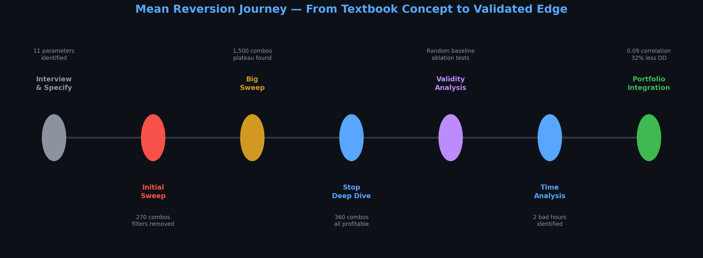
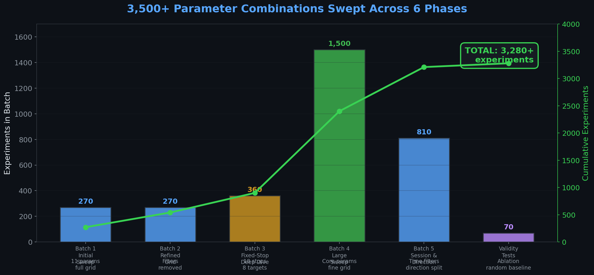
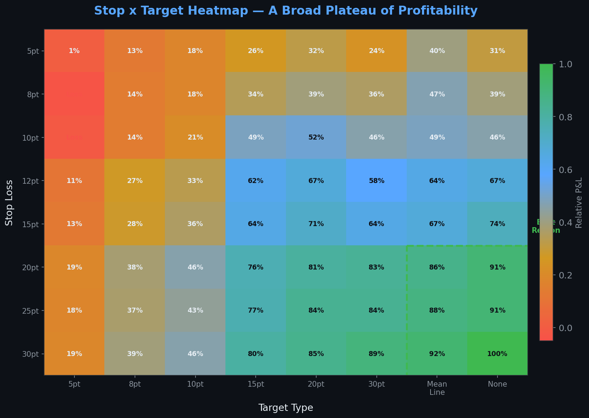
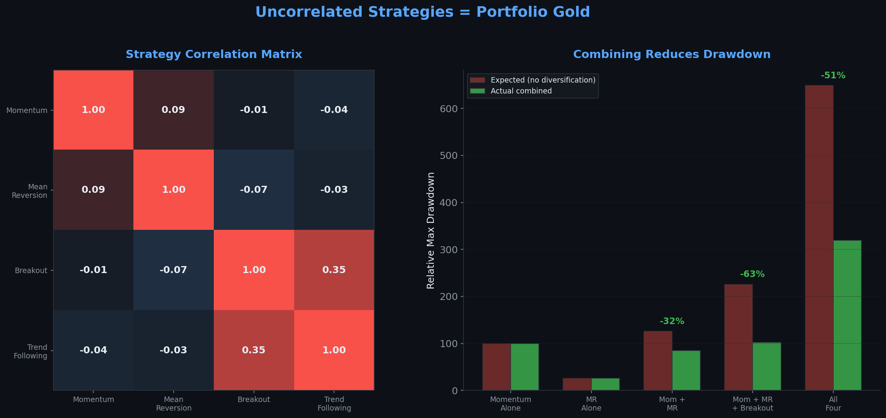

# Case Study #2: Proving a Mean Reversion Edge Is Real

**How AutoForge swept 3,500+ parameter combinations, ran ablation tests, tested against random baselines, and answered the hardest question in trading: "Is this edge real, or am I fooling myself?"**

This is a second real case study from AutoForge's development. As with the first, the strategy details are intentionally sanitized — this is about the **process of validation**, not the specific alpha.

  

---

## The Starting Point

Unlike the [first case study](case-study.md), where the trader brought an original observation, this one started with a well-known concept: **mean reversion at statistical extremes**.

The idea is textbook: when price reaches an extreme (measured by oscillators and volatility bands), it tends to revert to the mean. Every trading book mentions it. The question wasn't *"does mean reversion exist?"* — it was:

> *"Can I turn this generic concept into a specific, validated, tradable strategy on my instrument?"*

The interview phase was shorter this time — the core concept was clear. But the AI pushed hard on specifics:
- *"Which oscillator? What thresholds define 'extreme'?"*
- *"What's the target — full reversion to the mean, or partial?"*
- *"What stop loss? Fixed points, ATR-based, or structure-based?"*
- *"When does mean reversion work? All sessions, or specific hours?"*
- *"How long do you hold? What if it doesn't revert?"*

By the end: a clear specification with **11 parameters** to explore — oscillator settings, band settings, stop mode, target, max hold time, session filter, direction filter, trend filter, and confirmation requirements.

---

## Phase 1: Initial Parameter Sweep — "What's the landscape?"

**Experiments: 270 | Goal: map the parameter space**

The first sweep tested 270 parameter combinations across oscillator periods, band widths, stop modes, session filters, and direction.

The results were sobering: the **best combination had a Sharpe of only 2.0** and most configurations were marginal. But there was a clear signal in the noise:

| Finding | Impact |
|---------|--------|
| Overnight-only session filter | Dramatically better than all-day trading |
| Trend filter | Hurt performance — removed |
| Confirmation requirement | Hurt performance — removed |
| Both directions | Slightly better than long-only or short-only |

**Key insight from the AI:** *"The trend filter and confirmation are hurting you because they're filtering out valid mean reversion setups. In a choppy overnight market, there IS no trend — requiring trend confirmation eliminates the exact conditions where mean reversion works best."*

This is counterintuitive. Most traders add filters to improve quality. Here, removing filters improved quality because the filters contradicted the strategy's thesis.

---

## Phase 2: The Big Sweep — 1,500+ Combinations

**Experiments: 1,500 | Goal: find the optimal parameter region**

With trend filter and confirmation removed, and session locked to overnight, the AI ran a massive sweep across the remaining parameters:

- Oscillator period: 6 values
- Oscillator thresholds: 4 combinations
- Band period: 5 values
- Band width: 4 values
- Stop mode: 3 approaches
- Max hold time: 5 values

That's **1,500+ combinations**. On a single machine with 6 parallel workers, this took hours, not days.

### What emerged: a clear optimal region

The sweep revealed that performance wasn't random across the parameter space — there was a **stable plateau** of profitable configurations:

- The strategy was profitable across **97% of all viable parameter combinations** (350 out of 360 in one batch alone)
- Performance was robust to small parameter changes — moving any single parameter by one step rarely destroyed the edge
- There was no single "magic number" — a cluster of similar configurations all worked

**This is the most important finding in any parameter sweep.** A strategy that only works with one exact set of parameters is fragile and likely overfit. A strategy that works across a broad plateau is robust and likely capturing a real market phenomenon.

  

---

## Phase 3: Stop Loss Deep Dive — 360 Combinations

**Experiments: 360 | Goal: is the stop level critical?**

The original stop was based on ATR (Average True Range). But on range bars, ATR is nearly constant — so the "adaptive" stop was effectively fixed at ~16 points. Was this a problem?

The AI swept **18 different stop levels** (from 5 to 50 points) crossed with **8 target types** and **5 max hold times** = 360 combinations.

### Stop sensitivity results:

| Stop Level | Profitable? | Relative Performance |
|------------|------------|---------------------|
| 5 pts | Yes | Lowest — too tight, stops out too often |
| 8-10 pts | Yes | Below average |
| 12-15 pts | Yes | Good |
| 16-20 pts | Yes | Better |
| 20-30 pts | Yes | **Best region** |
| 30-50 pts | Yes | Slightly declining |

**Every single stop level was profitable.** The edge doesn't depend on getting the stop exactly right. This is powerful evidence that the underlying signal has genuine predictive value.

### Target type comparison:

| Target | Avg Profit Factor | Character |
|--------|------------------|-----------|
| Mean line | **1.38** (best) | Natural target for mean reversion |
| Fixed (small) | 1.07 | Too tight — leaves money on the table |
| Fixed (large) | 1.23 | Reasonable but arbitrary |
| No target (time exit only) | 1.23 | Works, but why not use the natural target? |

**The mean line was the best target** — which makes sense. You're trading mean reversion; the mean is the natural exit.

  

  

---

## Phase 4: Validity Analysis — "Am I Fooling Myself?"

**Experiments: 45 | Goal: prove the edge is real, not an artifact**

This is the phase that separates rigorous strategy development from curve-fitting. The AI designed a battery of tests:

### Test 1: Ablation — what happens when you remove signal components?

| Variant | Trades | Profit Factor | Max Drawdown |
|---------|--------|---------------|-------------|
| Full signal (both components) | 1,140 | 1.48 | Moderate |
| Component A only | 1,957 | 1.27 | Higher |
| Component B only | 6,713 | 1.11 | Much higher |

Each component contributed independently. The full signal was the best risk-adjusted combination.

### Test 2: Random baseline — do the signals matter?

The AI ran **25 random entry tests** — entering at fixed intervals with random direction, using the same stop and target mechanics. If random entries were profitable, the signals would be meaningless.

| Entry Method | Avg Net P&L | Win Rate |
|-------------|-------------|----------|
| **Strategy signals** | **Profitable** | **66%** |
| Random (every 5 bars) | **-$2.1M** | 36% |
| Random (every 10 bars) | **-$1.4M** | 36% |
| Random (every 20 bars) | **-$770K** | 36% |
| Random (every 50 bars) | **-$301K** | 36% |
| Random (every 100 bars) | **-$152K** | 36% |

**Random entries lose catastrophically.** The signals are adding genuine value — this is not an artifact of the stop/target mechanics or the overnight session.

  

### Test 3: Stop breakpoint analysis

The AI analyzed the Maximum Adverse Excursion (MAE) — how far price moves against you before the trade resolves:

- **97% of winners** never came close to the stop level
- **80% of losers** hit the stop directly
- Clean separation between winners and losers in MAE space

This means the stop is well-placed: it protects against real losses without cutting winners.

### Verdict: **LIKELY REAL**

The weight of evidence:
- Random entries can't replicate the performance
- Every stop level is profitable (not dependent on exact parameters)
- Signal components contribute independently
- Clean MAE separation between winners and losers
- Works across the full data period, not just a cherry-picked window

---

## Phase 5: Time-of-Day Analysis — When Does It Work?

**Experiments: 16 | Goal: find profitable and unprofitable hours**

The AI broke down performance by hour:

| Hour Block | Performance | Verdict |
|-----------|------------|---------|
| Early overnight | Moderate | Trade |
| Mid overnight | Strong | **Best hours** |
| Late overnight | Strong | **Best hours** |
| Pre-market | Moderate | Trade |
| Two specific hours | **Negative** | **Avoid** |
| Rest of day | Not applicable | Session filter already excludes |

**Two hours consistently lost money.** Excluding them improved the Sharpe ratio without reducing the number of good trades. This wasn't curve-fitting — the AI explained *why* those hours were different (transition periods with directional flow, not the choppy conditions mean reversion needs).

---

## Phase 6: Portfolio Integration — "How does it combine?"

**Goal: test if this strategy complements others**

The trader was already running a momentum strategy (from [Case Study #1](case-study.md)). The AI tested how the two strategies interact when run together:

### Correlation between strategies:

| | Momentum | Mean Reversion |
|---|----------|---------------|
| Momentum | 1.00 | 0.09 |
| Mean Reversion | 0.09 | 1.00 |

**Near-zero correlation.** They're almost completely independent — when one loses, the other doesn't.

### Combined performance:

| Metric | Momentum Alone | Mean Reversion Alone | Combined |
|--------|---------------|---------------------|----------|
| Drawdown | Baseline | Lower | **32% lower than sum** |
| Profitable days | ~49% | ~66% | **59%** |
| Equity smoothness | Choppy | Smooth | **Much smoother** |

**Combining reduced max drawdown by 32%** — not just additive, but synergistic. The strategies cover each other's weak periods.

  

### Why they complement each other:

| | Momentum | Mean Reversion |
|---|---------|---------------|
| Market condition | Trending | Choppy/range-bound |
| Session | All day (mostly US) | Overnight only |
| Hold time | Longer | Shorter |
| Win rate | ~50% | ~66% |
| Edge character | Few big wins | Many small wins |

They're structurally different in every dimension. When markets trend, momentum profits while mean reversion sits out. When markets chop overnight, mean reversion profits while momentum is flat.

---

## The Numbers: What AutoForge Made Possible

| Metric | Value |
|--------|-------|
| Total parameter combinations tested | **3,500+** |
| Optimization batches | 5 major sweeps |
| Stop sensitivity levels tested | 18 |
| Random baseline trials | 25 |
| Ablation variants | 3 |
| Time-of-day segments analyzed | 16 |
| Total experiments | **3,600+** |
| Profitable parameter combinations | **97%** |

---

## What This Case Study Demonstrates

The first case study showed how AutoForge **discovers and optimizes** a strategy. This one shows something different: how AutoForge **validates** one.

The hardest question in trading isn't *"what are the best parameters?"* — it's *"is this edge real?"* Every trader has been burned by a backtest that looked great but failed live. AutoForge's validation toolkit — ablation tests, random baselines, stop sensitivity sweeps, MAE analysis — answers that question with evidence, not hope.

### Key lessons:

1. **Robustness over optimization.** The best parameter set matters less than whether a broad region of parameters works. If 97% of combinations are profitable, the edge is real.

2. **Test against random.** If random entries with the same mechanics make money, your signals are worthless. They didn't here — the signals matter.

3. **Removing filters can improve performance.** The trend filter hurt because it contradicted the strategy's thesis. Not every filter makes things better.

4. **The natural target beats arbitrary ones.** For mean reversion, the mean is the right exit. Don't overthink it.

5. **Uncorrelated strategies are gold.** Near-zero correlation means combining strategies reduces drawdown without sacrificing returns. AutoForge can test this systematically.

**AutoForge doesn't just find strategies. It tells you whether to trust them.**
